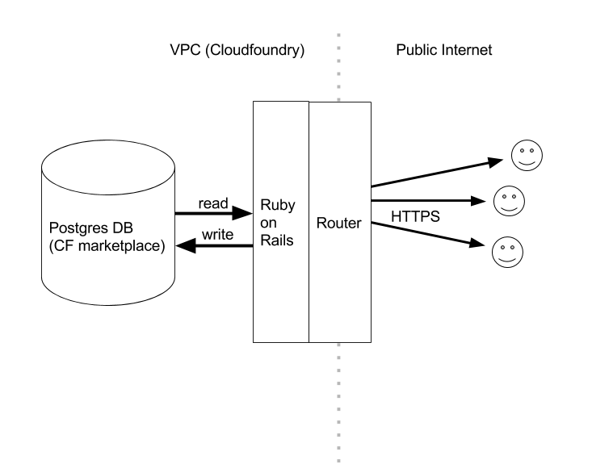
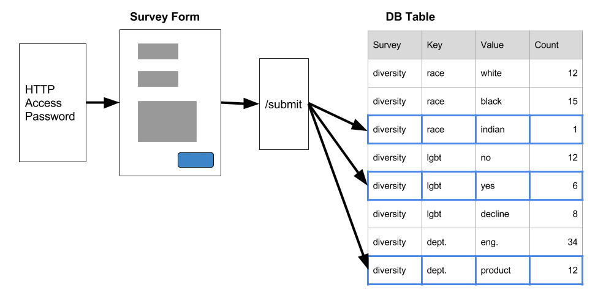

# Confidential Survey

This System Security plan provides an overview of the security requirements for Confidential Survey, a hosted service for securely conducting surveys for sensitive topics without recording personally identifiable information (PII) about the survey participants. The Survey tool is implemented as a Ruby on Rails application running on the Cloud.gov platform. This document describes the system system and TK information for the condidential survey application.

The security safeguards implemented for the Confidential Survey system meet the policy and control requirements set forth in this System Security Plan.  All systems are subject to monitoring consistent with applicable laws, regulations, agency policies, procedures and practices.

Unique Identifier | Information System Name | Information System Abbreviation
--- | --- | ---
Confidential Survey | 18F Confidential Survey tool | Survey

# System Categorization
The overall information system sensitivity categorization is noted in the table that follows.

Low | Moderate | High
--- | --- | ---
X | |

# Security Objectives Categorization
Security Objective | Open Data
--- | --- | ---
Confidentiality | N/A
Integrity | Low
Availability | Low

Using this categorization, in conjunction with the risk assessment and any unique security requirements, we have established the security controls for this system, as detailed in this SSP.

# General System Description

## System Function or Purpose

### Information System Components and Boundaries

## Types of Users

#### Administrator
Internal, Low sensitivity

Creates and uploads new surveys to the production server

#### Survey User
Public, Low sensitivity

Fills out surveys when provided with a link to the form

## Network Architecture

The following diagram provides an overview of the survey application's network architecture

## Hardware Inventory
Leveraged from AWS - None

## Software Inventory

### Survey Application
Ruby on Rails

Postgres SQL server

## Network Inventory
Leveraged from AWS - None

## Ports, Protocols and Services

Ports (TCP/UDP) |	Protocols |	Services |	Purpose
--- | --- | --- | ---
443/TCP |	HTTPS |	HTTPS Web Service |	Survey Application running on Cloud.gov	 |

## Data Flows

### Taking a Survey
To take a survey, a user must first enter some basic HTTP Authentication credentials (these are shared across all users and would not identify a single user). The credentials are just there to limit access to 18F employees and/or potential hires. The user would also need to know the exact URL of the survey they are invited to take (there is no root-level directory of surveys).

Once the user submits a survey, the complete response is used only to increment counters for various fields and a full record of the survey is not retained. The user is redirected to a screen thanking them for their participation.

### Deploying a Survey
Survey questions are not formed in the database but are instead read as configuration files within the project. This means that surveys can only be launched by users who can deploy the application and could not be altered/created by someone who gained access to the database.

### JSON Data
To allow admin users to retrieve the count, the system also supports a JSON endpoint for each survey at `/surveys/SURVEY_NAME.json`. This is secured with a different HTTP Authentication password than the one used by survey takers that should only be used by personnel and scripts authorized to download the JSON.

While it is the goal to eventually make the JSON for each survey public, this should not be done by copying the JSON to a static file (perhaps on S3) rather than serving it directly from the application
